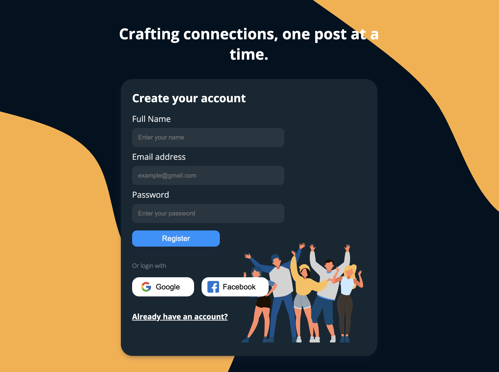
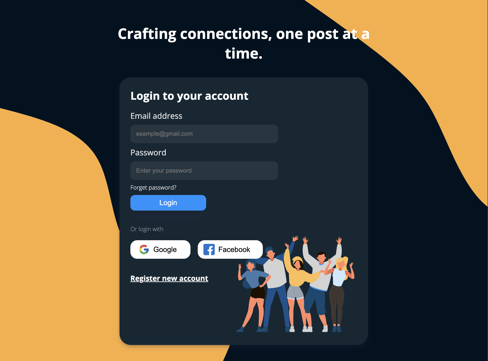

# Social Media Project: Not My Space - MERN

## Frameworks used

- ReactJS
- ExpressJS
- MongoDB: Mongoose
- NodeJS

## Login / Regsiter Form

The login / register form is built using **React** and **Module CSSS**, the form is repsonsive and the isnpiration of the design was taken from an online resource [themeforest](https://themeforest.net/) and the background image for the form was obtained from
[haikei](https://app.haikei.app/).

### Form Authentication and Validation

**Frontend**

**Backend**

### Desktop Current View

)

### Mobile Current View

.jpeg>)
